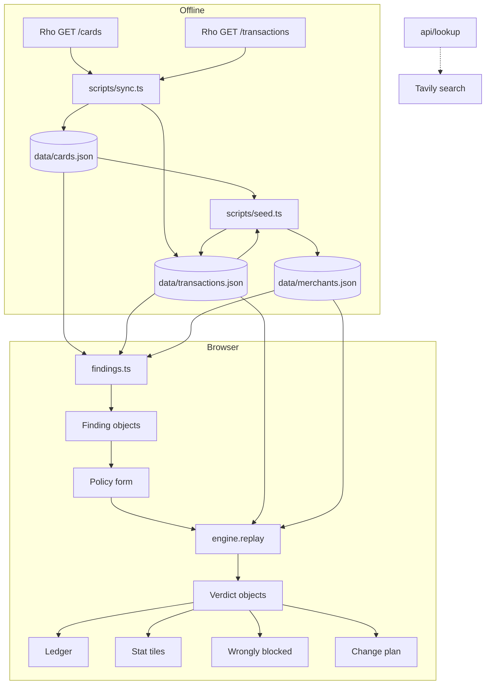
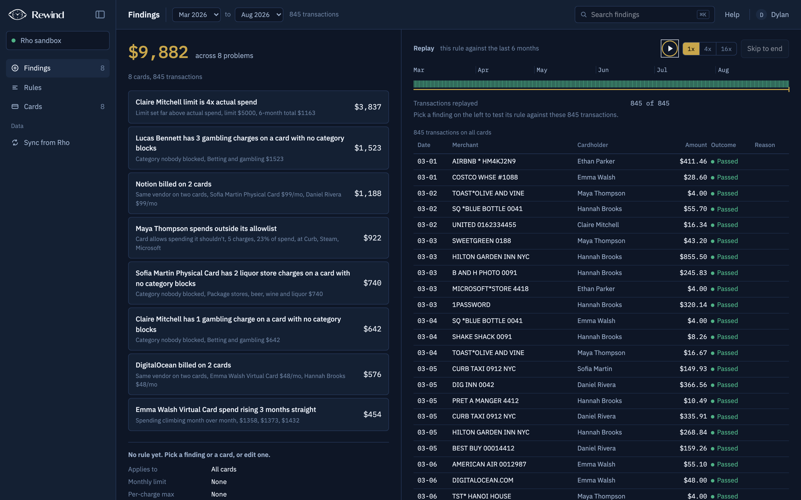
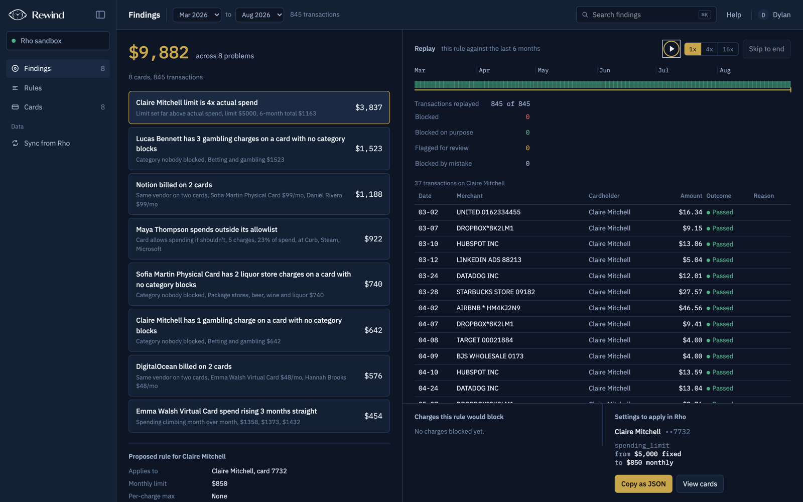
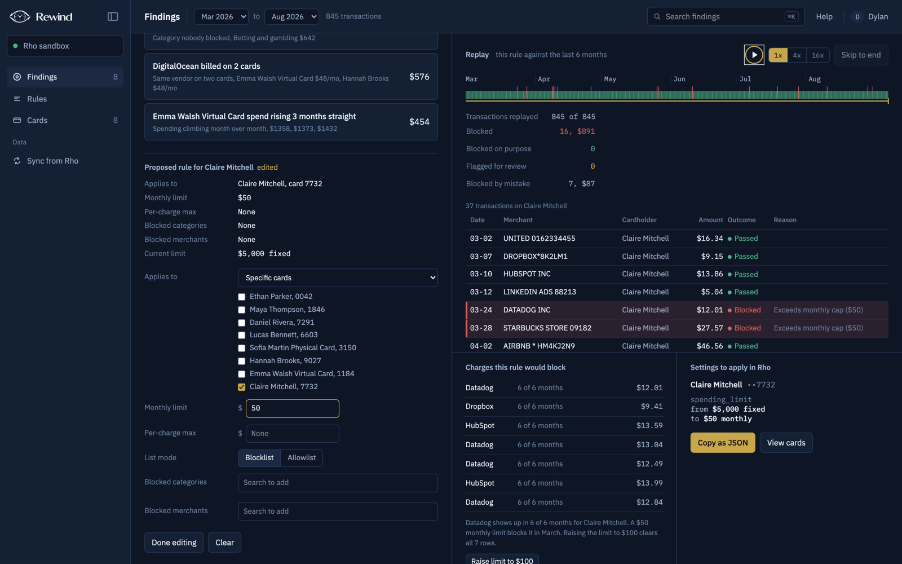
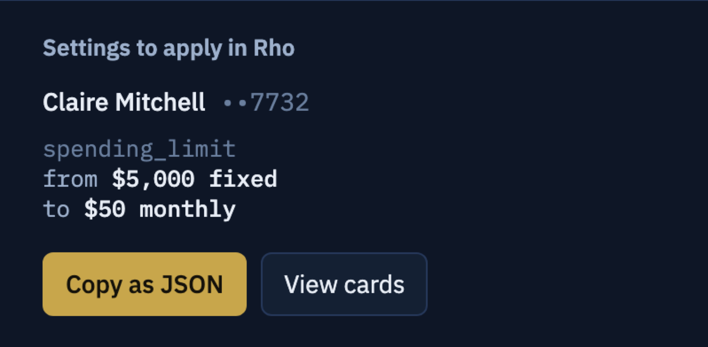
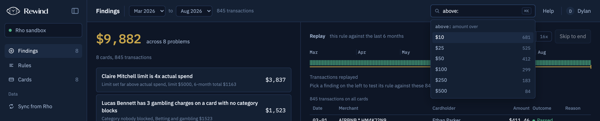
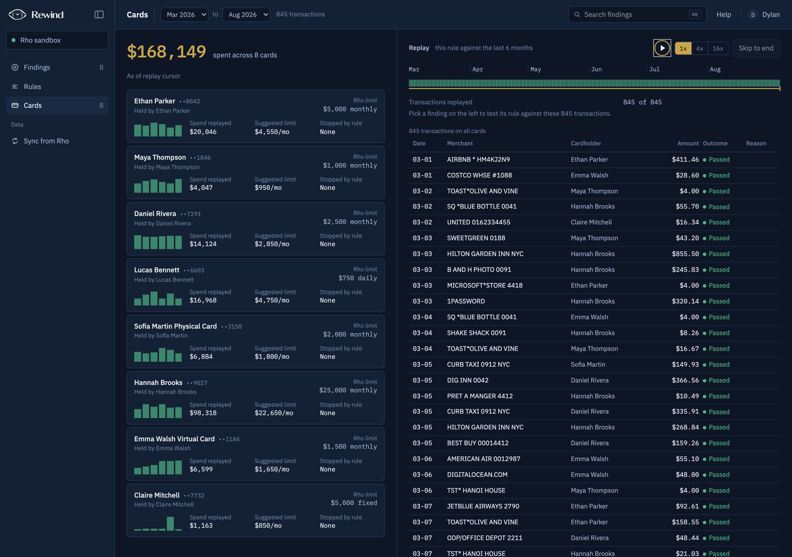
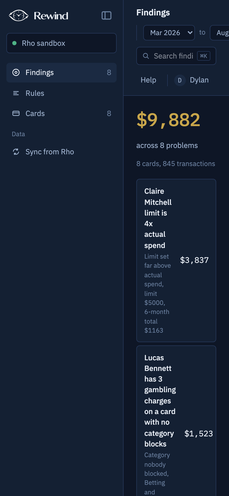

<div align="center">

<h1>Rewind</h1>

<p>Replay a proposed Rho card rule against six months of card history before you turn it on.</p>

<table>
  <tr>
    <td><a href="https://rewind-dynotix.vercel.app">Live app</a></td>
    <td><a href="https://github.com/dynotics/rewind">GitHub repo</a></td>
    <td>LOCK IN Hack 2026 at Rho</td>
  </tr>
</table>

<p>
  
  
  
  
  
  
  
  
</p>

</div>

## Why this exists

Rho ships spending limits, merchant blocks, category blocks and merchant allowlists on every card, and enforces them at the register. A charge that trips a control is declined on the spot. The controls themselves are described in Rho's [Understanding Rho Card Controls](https://www.rho.co/help-center/cards/understanding-rho-card-controls) article.

What Rho does not ship is any way to test a control before it goes live. Nothing tells an admin which cards are missing a control, or that a limit is four times what the card actually spends. The limit they are about to set might decline the Datadog invoice on the 24th. Nothing warns them. So limits get set by guessing and calibrated by watching people get declined. Rho's own help center carries an article titled [Why Was My Rho Card Declined?](https://www.rho.co/help-center/cards/why-was-my-rho-card-declined) for this reason.

Rewind pulls the cards and settled transactions from a Rho account, scans them for problems, and lets you replay a candidate rule over the history to see exactly which past charges it would have blocked, which of those blocks would have been mistakes, and what to type into Rho to apply it.

## Data flow



Offline, [`sync.ts`](scripts/sync.ts) pages through the sandbox with [`rho.ts`](src/lib/rho.ts), maps the raw shapes in [`mapRho.ts`](src/lib/mapRho.ts), and writes the two JSON files. [`seed.ts`](scripts/seed.ts) then reads them back, generates history against the same cards, and writes the transactions and merchant catalog. In the browser, [`page.tsx`](src/app/page.tsx) imports the three JSON files directly, so the app runs with no backend. The Sync from Rho button in the sidebar swaps in live data through [`api/live`](src/app/api/live/route.ts), which proxies the same two Rho endpoints with the server's token. The [`api/lookup`](src/app/api/lookup/route.ts) route takes a merchant descriptor and returns the top three Tavily results for it.

## The pieces

- **Six detectors scan the history for problems.** [`findings.ts`](src/lib/findings.ts) runs each card through five checks and the whole ledger through a sixth. A recurring merchant billed on two or more cards for at least four months each is a duplicate subscription. A card with an allowlist whose charges fall outside it is control leakage. Charges in MCC 7995, 5921 or 0742 on a card that does not block that code are a risk category. A card with no limit, a monthly limit above three times its 95th percentile month, or a fixed limit above twice its six month total is flagged, and a card whose last three months each rose above the one before is spend acceleration. Every finding carries a dollar impact and a suggested [`Policy`](src/lib/types.ts), and the list is sorted by impact.
- **One verdict per charge** comes out of [`engine.ts`](src/lib/engine.ts), which takes the transactions, a policy and the merchant catalog and returns a `Verdict` of pass, flag or block for each one in posted order, with the reasons that fired and the month's running total after the charge, and [`useReplay.ts`](src/components/useReplay.ts) reveals those verdicts as the playback cursor advances so the tiles and ledger fill in over time.
- [`recommend.ts`](src/lib/recommend.ts) buckets each card's charges by Eastern month, takes the 95th percentile of the monthly totals, adds 15 percent, and rounds up to the next 50 dollars. The same function proposes a per-charge threshold from the 95th percentile charge plus 25 percent, which the replay flags but cannot block, because Rho exposes no per-charge control on a card. The findings use the same cap formula when they propose a limit.
- **Wrongly blocked charges.** `wronglyBlocked` in [`analysis.ts`](src/components/analysis.ts) marks a blocked charge as wrong when its merchant is a recurring vendor, or when a limit block hits an amount within 30 percent of the median of at least three charges to the same merchant by the same holder. `capToClear` computes the smallest monthly limit, rounded up to 50 dollars, that would let all of them through, and the panel offers it as a one-click edit.
- **The change plan** in [`changePlan.ts`](src/lib/changePlan.ts) diffs the policy against each card in scope and emits `spending_limit`, `spending_limit_type`, and either `blocked_categories` and `blocked_merchants` or `allowed_categories` and `allowed_merchants`, depending on which mode the card is already in, with a card the policy already matches left out and the copy button serialising the payloads with their `card_id`.

## Screens

| | |
|---|---|
|  |  |
| **Findings.** Eight problems ranked by dollar impact, with the total at stake in the headline. The right side stays on the raw ledger until a finding is picked. | **Replay.** The rule proposed for the top finding, run to the end of the window, with the strip across the top marking every charge, the tiles counting outcomes, and the ledger showing each verdict with its reason. |
|  |  |
| In this one the limit is edited down to 50 dollars. The lower left panel lists the recurring vendors the rule would decline, how many months each has billed, and the limit that would clear them all. | **Change plan.** The same rule in Rho's field names, with the card's current setting beside the proposed one, and Copy as JSON emitting one object per card. |
|  |  |
| **Search.** Typing a token key opens its values with a count of matching charges, and the tokens narrow the ledger and combine with plain words. | The cards view shows all eight sandbox cards with their real Rho limits and controls, spend replayed so far, and a suggested monthly limit for each. |



## Rules the replay follows

The rules in [`engine.ts`](src/lib/engine.ts), and why each one is there:

- **Charges replay in posted order,** so a running monthly total means what it would have meant on the day.
- **Charges outside the policy's scope pass untouched.** Scope is all cards, a set of cards, or a set of cardholders, and out of scope charges neither block nor count toward a total.
- **Merchant checks run first.** In blocklist mode a charge blocks when its merchant's MCC or canonical name is listed, and an unknown merchant passes because there is nothing to match. In allowlist mode a charge blocks unless it is listed, so an unknown merchant blocks, which is what a Rho allowlist would do at the register. An empty allowlist blocks nothing.
- **The per-charge maximum flags rather than blocks,** because Rho exposes no per-charge control on a card. The change plan appends a note saying so and suggests a lower monthly limit or a fixed-amount virtual card instead.
- **Months are keyed to Eastern Time** through `monthKeyET`, because that is when Rho resets monthly limits. A charge posted at 03:00 UTC on the first belongs to the previous month.
- **The monthly cap blocks the charge that would cross it,** and the total is kept per card, or per cardholder when the scope is a set of users.
- **A blocked charge does not consume budget.** The running total only grows on pass and flag, so one large decline does not push the next small charge over the cap too.
- **Every verdict carries its reasons as text,** and the UI reads them back: `isCaught` in [`analysis.ts`](src/components/analysis.ts) treats merchant and allowlist blocks as the rule doing its job, and limit blocks as candidates for the wrongly blocked panel.

The tests in [`engine.test.ts`](tests/engine.test.ts) pin down the cap crossing, the month reset, the budget rule and both list modes.

## The merchant join

A Rho transaction carries a `counterparty_name` and no category. A Rho card blocks by category code. To replay a category block, every descriptor has to be joined to an MCC, and that join is [`data/merchants.json`](data/merchants.json): a map from the raw descriptor to a canonical name, an MCC and its name, and whether the merchant bills on a schedule.

The engine matches on the exact raw descriptor, so the catalog has to contain every string that appears in the ledger. [`seed.ts`](scripts/seed.ts) builds it. Descriptors it generated come from a hand-written list with known codes. The six real sandbox descriptors get a code from a short regular expression table in the same file, with business services as the fallback. A merchant is marked recurring when the same card sees it in at least four months on a billing day that drifts by no more than three days.

For lookups, [`merchantLexicon.ts`](src/lib/merchantLexicon.ts) normalizes a descriptor the way a person would read it: it strips processor prefixes such as `SQ *` and `TST*`, trailing store and reference numbers, and a trailing city and state. The lookup route searches for that normalized name.

An earlier version went further. [`resolveMerchants.ts`](src/lib/resolveMerchants.ts) searched Tavily for each merchant, scored the result text against keyword lists per MCC, and tried to scrape a list price from the vendor's pricing page. The classifications were wrong often enough that the approach was retired when the lookup route was added. The file is still in the tree, but nothing imports it, and the route returns search results without guessing a category from them.

## Where the data comes from

All eight cards in [`data/cards.json`](data/cards.json) are real sandbox objects pulled by [`sync.ts`](scripts/sync.ts), with their actual limits and controls: Ethan Parker's card blocks veterinary services and Petco, Maya Thompson's is allowlisted to restaurants and Sweetgreen, Lucas Bennett's has a 750 dollar daily limit, Claire Mitchell's has a 5,000 dollar fixed limit, and Hannah Brooks's has a 25,000 dollar monthly one.

The sandbox ships six settled card transactions, all posted in the last week of June 2026. That is not enough history to learn anything from, so [`seed.ts`](scripts/seed.ts) generates six months, March through August 2026, against those same cards with a fixed random seed. It reads each card's real limit type and sizes the months to fit: a fixed limit is treated as a lifetime budget, a daily limit shapes each day's charges, and an allowlisted card leaks a handful of charges outside its list. The six real rows are kept with their Rho ids, generated rows are prefixed `seed-`, and the script books the real rows into their months first so the generated totals sit around them. It also plants the charges the detectors are meant to find: gambling on two cards, liquor on one, a personal purchase, and two large tickets. The findings on the demo are real findings over planted evidence.

## Running it

```bash
cp .env.example .env.local   # fill in RHO_BASE_URL, RHO_TOKEN, TAVILY_API_KEY
npm install
npm run dev                  # http://localhost:3000, uses the committed JSON
```

The app needs no keys to run against the committed data. `RHO_BASE_URL` and `RHO_TOKEN` are read by [`rho.ts`](src/lib/rho.ts) for `npm run sync` and the live route. `TAVILY_API_KEY` is read by the lookup route. `ANTHROPIC_API_KEY` appears in [`.env.example`](.env.example) but nothing reads it.

```bash
npm run sync   # overwrite data/cards.json and data/transactions.json from the sandbox
npm run seed   # regenerate the six months of history and data/merchants.json
```

Running `sync` without `seed` leaves you with the six real rows only.

## Tests

```bash
npm test
```

Vitest runs five files and 45 tests. [`engine.test.ts`](tests/engine.test.ts) covers the replay rules above. [`findings.test.ts`](tests/findings.test.ts) runs the detectors over the committed data and checks that a duplicate subscription and a gambling finding appear with positive impact in sorted order. [`changePlan.test.ts`](tests/changePlan.test.ts) checks the field names for a limit change and an allowlisted card, and that a matching card is omitted. [`monthRange.test.ts`](tests/monthRange.test.ts) covers the date range in the URL and Eastern month bucketing. [`query.test.ts`](tests/query.test.ts) covers the search tokens, their suggestions, and the filter they produce.

## Limitations

- **Only six of the 845 transactions are real.** The rest are generated to fit the sandbox cards, and the findings depend on charges the seed script planted.
- **The MCC join is guessed for real merchants.** The regular expression table in the seed script assigns codes to the six sandbox descriptors. A production version needs a real category source.
- **The lookup route is not wired into the UI.** The transaction drawer in [`TxnDrawer.tsx`](src/components/TxnDrawer.tsx) reads optional vendor fields from the merchant catalog and shows a pending state when they are absent, which is always, since no script writes them.
- **Nothing is written back to Rho.** The change plan is copied out by hand. The payload uses Rho's field names but has not been sent to the cards API.
- **Daily, weekly, quarterly and annual limits are not judged.** The limit detectors handle monthly and fixed limits only, and the replay models a monthly cap only.
- **The live route has no authentication.** [`api/live`](src/app/api/live/route.ts) proxies the sandbox with the server's token to anyone who calls it.
- **The layout is desktop first.** Below 1100 pixels the columns stack, but the sidebar does not collapse, as the phone screenshot above shows.

## Stack

Next.js 16 with the App Router and React 19, TypeScript 5, Tailwind CSS 4 imported in [`globals.css`](src/app/globals.css) alongside hand-written styles, Zod 4 for the schemas in [`types.ts`](src/lib/types.ts), Vitest 5, and `tsx` for the two scripts. IBM Plex Sans and Mono come through `next/font`. The Tavily SDK backs the lookup route. Deployed on Vercel.

## License

No license file is committed, and [`package.json`](package.json) marks the package private. All rights reserved until one is added.
